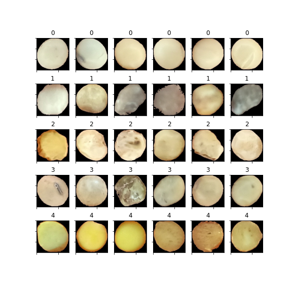

# Classification of soybean seeds based on images via Transfer Learning

This repository contains the analysis of a project developed during my AI Residency program on [HUB of Artificial Intelligence](https://www.senaipr.org.br/tecnologiaeinovacao/nossarede/hubia/). Unfortunately I don't own the data and cannot share it.

Also, you can read my [post](https://nagahamavh.github.io/posts/soybean-image-classification/) about this analysis.



## Setup

```bash
sudo ubuntu-drivers autoinstall
sudo apt-get install docker-compose nvidia-container-toolkit

sudo usermod -aG docker $USER

# reboot

git clone https://github.com/nagahamaVH/soybean-image-classif

cd soybean-image-classif

./build.sh
```

## Running

```bash
./run.sh
```
